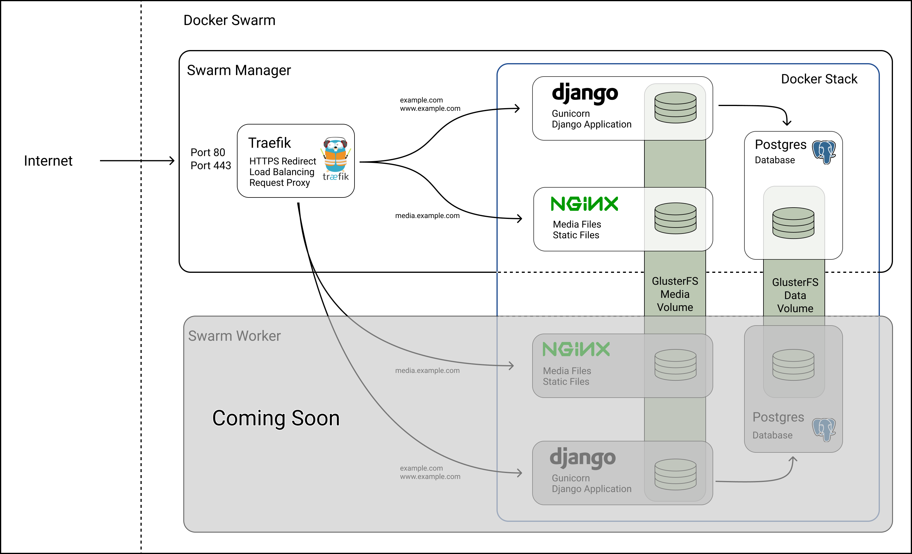

# Portfolio Page <!-- omit in TOC -->

## Contents <!-- omit in TOC -->

- [Description](#description)
- [Features](#features)
- [Technologies](#technologies)
- [Deployment](#deployment)
- [Run the App](#run-the-app)
  - [Docker-Compose](#docker-compose)
    - [Pull Docker Hub image](#pull-docker-hub-image)
    - [Build docker image locally](#build-docker-image-locally)
  - [Docker](#docker)
  - [Run directly on host machine](#run-directly-on-host-machine)

## Description

This project started as my personal portfolio page but has become so dynamically configurable, it could be used for any website. My instance of this softwar is running live at [fabianvolkers.com](https://fabianvolkers.com). It features an overview of the projects I've worked on as well as detail views for each project. Additionally, it features a selection of my photographs. There is a contact form for enquiries.

## Features

- Dynamically add pages with as many sections as you want
- Add links to other platforms you're active on
- Dynamically add collections with unlimited items
- Contact form with connection to smtp server
- Required email confirmation
-

## Technologies

This portfolio page is built with Python and Django. Django was chosen for it's powerful and secure ORM, built-in DB migrations and admin page for managing the database.

## Deployment

The app is running live at [fabianvolkers.com](https://fabianvolkers.com). The Django app is running as a service inside a Docker Swarm, in a stack with a postgres database container and an nginx container for serving media and static files. On top of that, load balancing and proxying is handled by a Traefik instance inside the Swarm. 


## Run the App
### Docker-Compose
#### Pull Docker Hub image
The easiest way to run the app is to take the included `docker-compose.yml` file and run `docker-compose up`. This will start 3 services.
1. Django App
1. Postgres DB
1. Nginx media and static server

All services will be pulled from docker hub. 

```bash

# Create a directory and download the docker-compose file
mkdir homepage && cd homepage
wget https://raw.githubusercontent.com/FabianVolkers/portfolio/latest/docker-compose.yml

# Create a directory for the nginx config and download it
mkdir -p docker/nginx && cd docker/nginx
wget https://raw.githubusercontent.com/FabianVolkers/portfolio/latest/docker/nginx/nginx.conf

## return to the project root and start the containers
cd ../../
docker-compose up -d
```
#### Build docker image locally
Alternatively you can uncomment the `build` tag and comment out the `image` tag, to build the container yourself. This will naturally only work if you have cloned this repository.

### Docker
If you just want to check out the django app without worrying about postgres or nginx, you can just use the following command to get started. This will use a small sample sqlite db. 
```bash
docker run --publish 8000:8000 --detach --name homepage fabiserv/homepage:latest
```

### Run directly on host machine

Alternatively you can clone the repo and use Django's manage.py runserver command.


```bash
# Clone the repository
git clone https://github.com/FabianVolkers/portfolio.git
cd portfolio

# Create and activate the virtual environment, install requirements
python3 -m venv venv
source venv/bin/activate
pip install -r requirements.txt

# Copy the example.env file into a .env file. Don't forget to replace the values with your own.
cp example.env .env

# Change into the project directory, initialise the database and run the server
cd homepage
python manage.py makemigrations portfolio
python manage.py migrate
python manage.py runserver
```
